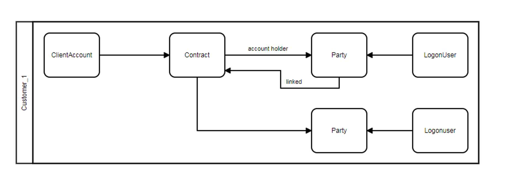

Turn this:
````powershell
$customer = [PSCustomObject]
@{
	ClientAccountId = 1
	ClientCode = 'clientCode'
	ContractId = 10
	ContractName = 'ContractName'
	TradingAccounts = @(
		@{
			TradingAccountId = 101
			TradingAccountCode = 'tac01'
		},
		@{
			TradingAccountId = 102
			TradingAccountCode = 'tac02'
		}
	)
	Relations = @(
		@{
			RelationshipType = 'AccountHolder'
			FromId = 10
			ToId = 11
			FromType = [LegalPartyType]::Contract
			ToType = [LegalPartyType]::Person
		},
		@{
			RelationshipType = 'Linked'
			FromId = 10
			ToId = 12
			FromType = [LegalPartyType]::Contract
			ToType = [LegalPartyType]::Person
		}
	)
	LegalParties = @(
		@{
			LegalPartyId = 11
			Name = 'LP_11'
		},
		@{
			LegalPartyId = 12
			Name = 'LP_12'
		}
	)
	LogonUsers = @(
		@{
			LogonUserId = 20
			Username = 'username1'
			LinkedToLegalPartyId = @(11,12)
		},
		@{
			LogonUserId = 21
			Username = 'username2'
			LinkedToLegalPartyId = @(12)
		}
	)
}
````

into this xml:

````xml
<?xml version="1.0" encoding="utf-8"?>
<bpmn:definitions xmlns:dc="http://www.omg.org/spec/DD/20100524/DC" xmln
s:di="http://www.omg.org/spec/DD/20100524/DI" xmlns:xsi="http://www.w3.o
rg/2001/XMLSchema-instance" xmlns:bpmni="http://www.omg.org/spec/BPMN/20
100524/DI" xmlns:bpmn="http://www.omg.org/spec/BPMN/20100524/MODEL">
  <bpmn:collaboration id="Collaboration_customer_clientCode">
    <bpmn:participant id="Participant_customer_clientCode" name="Custome
r_clientCode" processRef="Process_clientCode" />
  </bpmn:collaboration>
  <bpmn:process id="Process_clientCode">
    <bpmn:laneSet id="LaneSet_clientCode">
      <bpmn:lane id="Lane_clientCode">
        <bpmn:flowNodeRef>Task-Contract-10</bpmn:flowNodeRef>
        <bpmn:flowNodeRef>Task-ClientAccount-1</bpmn:flowNodeRef>
        <bpmn:flowNodeRef>Task-LP_11-11</bpmn:flowNodeRef>
        <bpmn:flowNodeRef>Task-LP_12-12</bpmn:flowNodeRef>
        <bpmn:flowNodeRef>Task-username1-20</bpmn:flowNodeRef>
        <bpmn:flowNodeRef>Task-username2-21</bpmn:flowNodeRef>
      </bpmn:lane>
    </bpmn:laneSet>
    <bpmn:task id="Task-Contract-10" name="Contract 10" />
    <bpmn:task id="Task-ClientAccount-1" name="ClientAccount 1" />
    <bpmn:task id="Task-LP_11-11" name="LP_11 11" />
    <bpmn:task id="Task-LP_12-12" name="LP_12 12" />
    <bpmn:task id="Task-username1-20" name="username1 20" />
    <bpmn:task id="Task-username2-21" name="username2 21" />
    <bpmn:sequenceFlow id="Sequenceflow-from-Task-Contract-10-to-Task-Cl
ientAccount-1" sourceRef="Task-Contract-10" targetRef="Task-ClientAccoun
t-1" />
  </bpmn:process>
</bpmn:definitions>
````
The end goal is to create a diagram like this:


